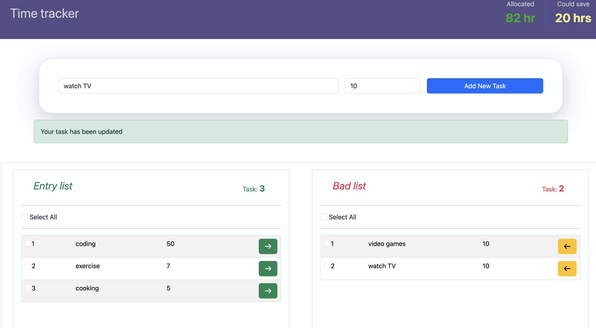

# Time Tracker

A full stack time management app that helps you track your weekly tasks and identify which ones are wasting your time. Tasks can be moved between an Entry list and a Bad list, giving you a clear picture of where your hours are going.

## Screenshot



## 🔗 Live Demo

> **Note:** This app is hosted on Render's free tier. If the demo is slow to load, the server may be spinning up — please wait 30 seconds.

> [View Live](https://time-tracker-api-l6bn.onrender.com/)

---

## ✨ Features

- **Add tasks** — enter a task name and hours, saved instantly to MongoDB
- **Entry list** — all active tasks displayed in a clean table
- **Bad list** — move tasks you consider unproductive to the bad list
- **Switch tasks** — move tasks between Entry and Bad list with one click
- **Bulk selection** — select single, multiple, or all tasks at once
- **Select All checkbox** — per list, unchecks automatically if any item is deselected
- **Delete button** — appears only when at least one item is selected, allowing single, multiple or full deletion in one action
- **Hours summary** — see total allocated hours and total hours you could save
- **168hr weekly limit** — app prevents adding tasks that exceed hours in a week

---

## 🛠 Tech Stack

**Frontend**

- React (Vite)
- Bootstrap 5
- HTML5 / CSS3
- Axios

**Backend**

- Node.js
- Express

**Database**

- MongoDB
- MongoDB Atlas (cloud hosted)

---

## 📦 Getting Started

### Prerequisites

- Node.js v20+
- Yarn
- MongoDB Atlas account — [get one here](https://www.mongodb.com/atlas)

### Local Development

1. Clone the repo

```bash
git clone https://github.com/bguragain1023-web/Time-Tracker-API
cd Time-Tracker-API
```

2. Install dependencies

```bash
yarn
```

3. Create a `.env` file in the root folder

```
MONGO_URI=your_mongodb_atlas_connection_string

```

4. Start the server

```bash
yarn dev
```

---

## 🚀 How to Use

1. Enter a task name and hours in the form
2. Click **Add New Task** — task is saved to MongoDB and appears in the Entry list
3. Click the **→** button to move a task to the Bad list
4. Click the **←** button to move it back to the Entry list
5. Select tasks using checkboxes — select one, multiple, or use **Select All**
6. Click **Delete** to remove all selected tasks at once

---

## 🔌 API Endpoints

| Method | Endpoint     | Description                  |
| ------ | ------------ | ---------------------------- |
| GET    | `/api/tasks` | Fetch all tasks              |
| POST   | `/api/tasks` | Create a new task            |
| PATCH  | `/api/tasks` | Switch task type (entry/bad) |
| DELETE | `/api/tasks` | Delete selected tasks        |

---

## 📁 Project Structure

```
Time-tracker-API Backend
.
├── README.md
├── dist ----- from frontend
│   ├── assets
│   │   ├── index-Bj1V9L3j.js
│   │   ├── index-D9kByYkR.js
│   │   └── index-ZCTVnd44.css
│   └── index.html
├── package.json
├── server.js
├── src
│   ├── config
│   │   └── dbConfig.js
│   ├── models
│   │   └── taskModels
│   │       └── taskSchema.js
│   └── routers
│       └── taskRouter.js
└── yarn.lock

```

---

## 🔐 Environment Variables

| Variable    | Description                          |
| ----------- | ------------------------------------ |
| `MONGO_URI` | Your MongoDB Atlas connection string |

## 🙋‍♂️ Author

**Brazesh Guragain**

- [View My GitHub](https://github.com/bguragain1023-web)
- [Visit My LinkedIn](https://www.linkedin.com/in/brazesh-guragain-32a6661b0/)
- [Visit My Portfolio](https://www.brazeshguragain.com)

---

## 📄 License

MIT License — feel free to use this project as inspiration for your own.
